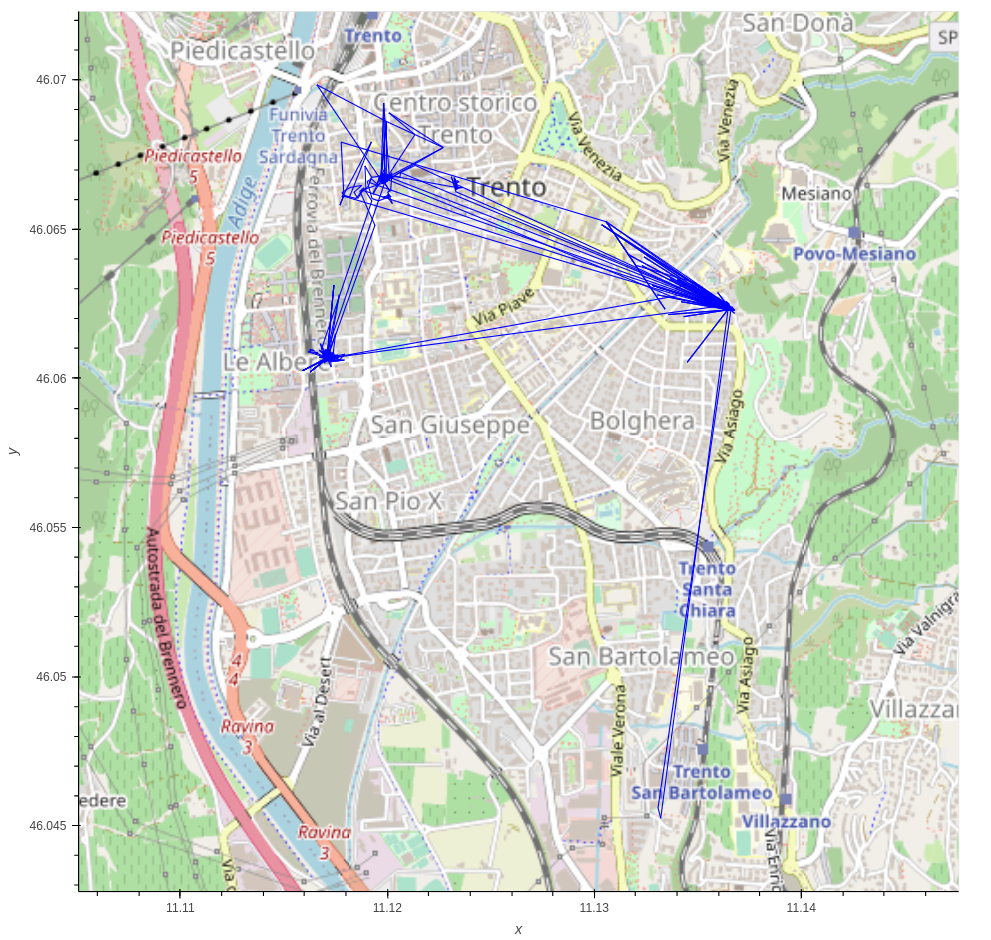
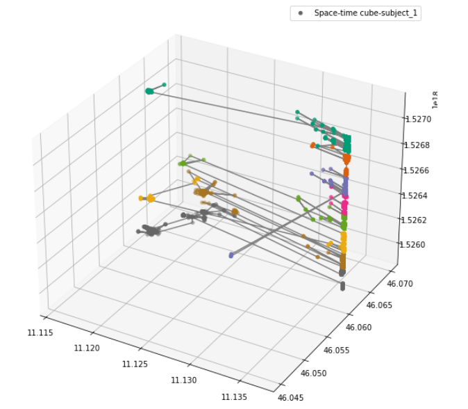
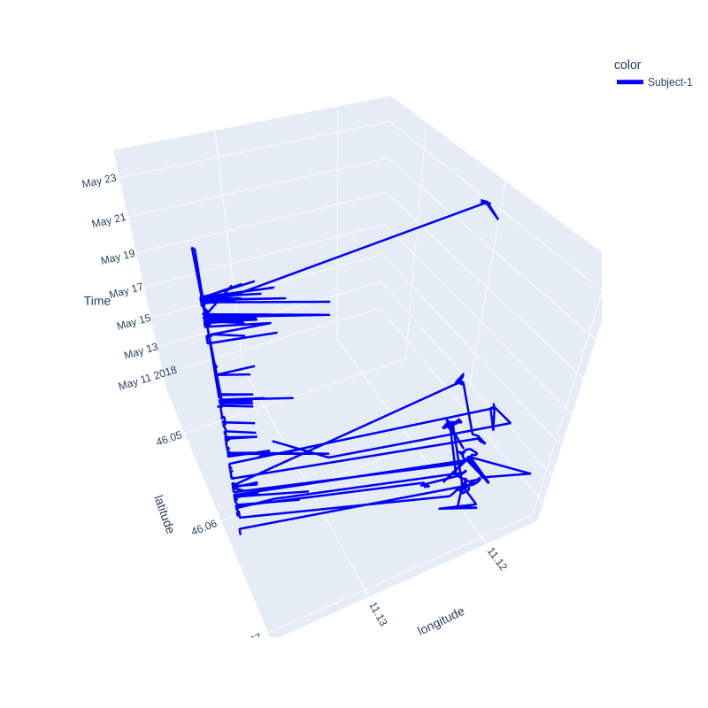
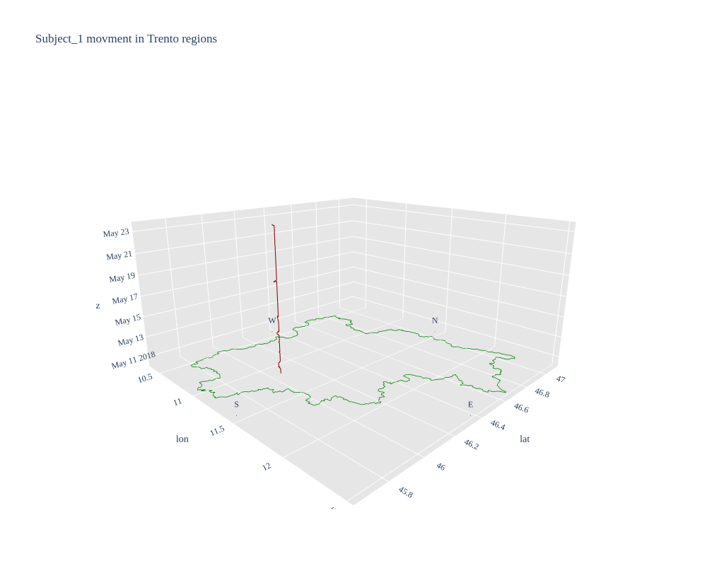
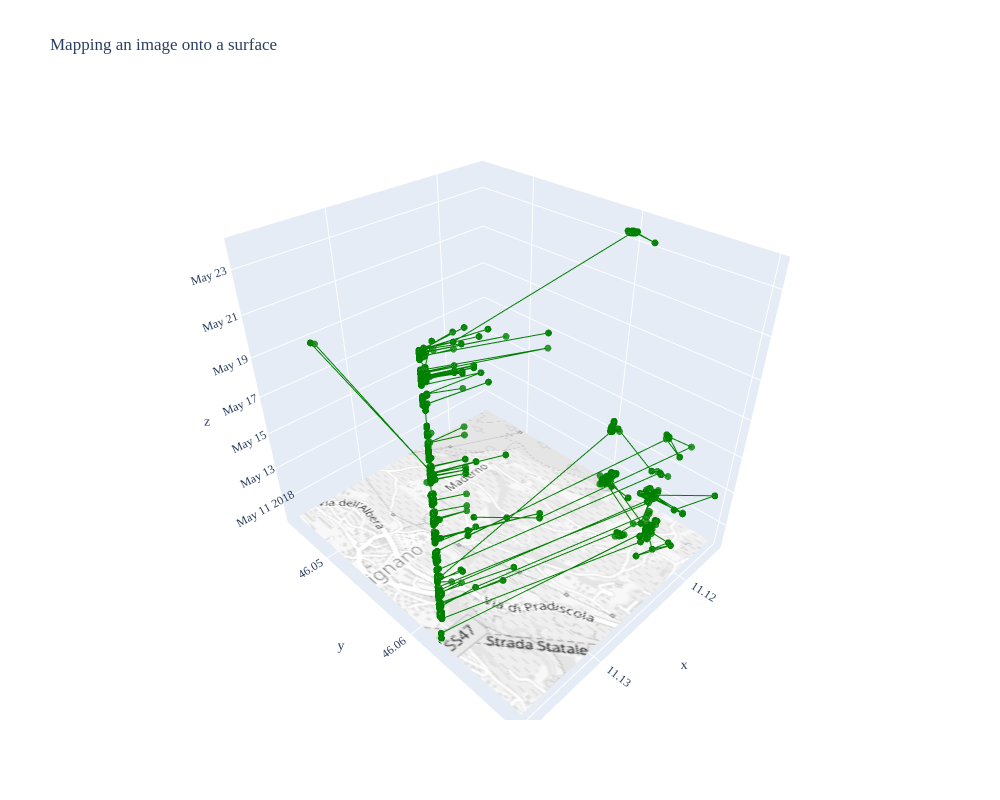
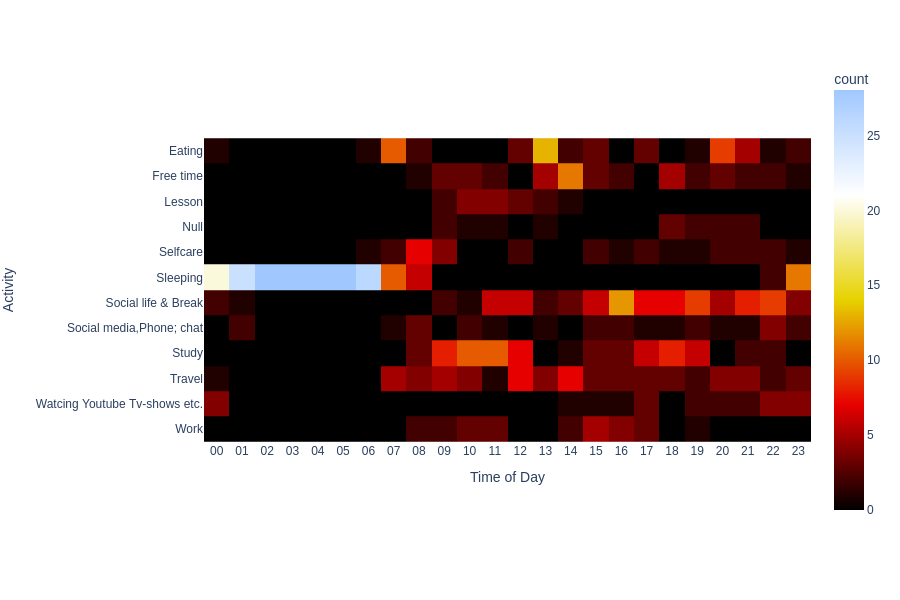
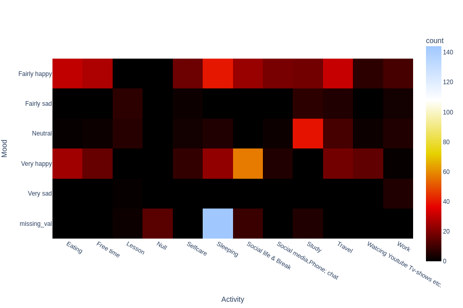
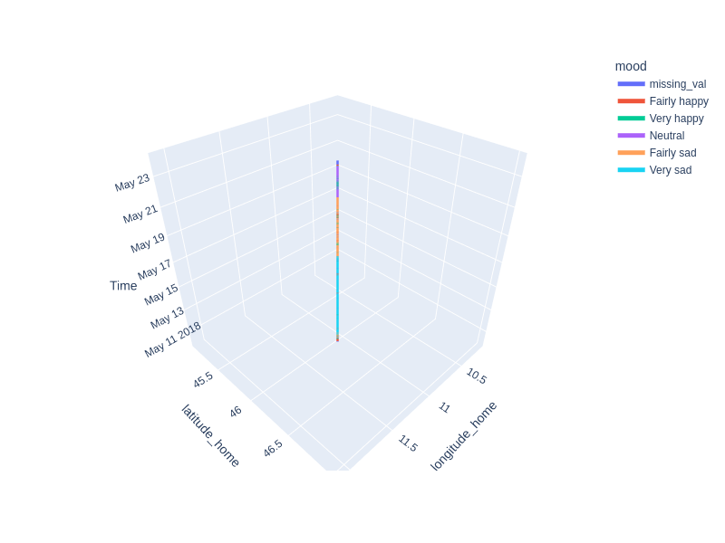
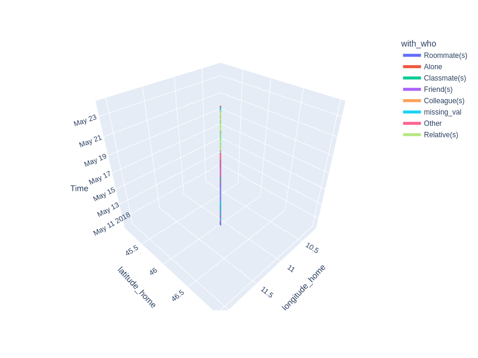

# Studies on Human Behaviour -   Course Project
##  Space-Time-Cube(STC-3D )and 4D visualization

Geovisualization of Spatio-temporal data is a very promising keynote, especially for social sciences. It is possible to use a space-time cube to divulge activity, travel patterns of different genders, racial groups, non-employees, etc., and all the information can be related to urban planning, transportation,location-based services, and many other fields dealing with individual geo-data.In this work, I used the GPS data that describe the movements of 3 subjects and Time-diaray data, data collected from the 3 subjects through the ilog-mobile application. 

* The specific objectives of this project are:

  - To visualize 3D Space Time Cube from a given GPS track of the 3 subjects 
  - To visualize 4D (Space Time Cube + Time-diaray data[mood,activity])
  - Mapping the person in the society, Tell the 3-weeks story of the subject, geography with analysis of behavior, and integrating ideas in human geography with human behaviour
 
## Results
### 2D openstreet map visualization of subject_1
* The map provides contextual information and makes it possible to understand subject trajectory


### 3D Space-time cube visualization of subject_1
* Space-time cube is one of the most efficient 3D geo-visualization techniques that contribute the Spatio-temporal data comprehension of human behavior[1].
* This concept was first introduced by [Hägerstrand-Swedish geographer](https://en.wikipedia.org/wiki/Torsten_H%C3%A4gerstrand). According to Hägerstrand; a life path can be visualized as a 3D space by projecting it on a 2D plane. As the base (x and y-axis) corresponds the geography, the height (z-axis) represents time. [2]
* There are different libraries that can be used for plotting data in 3D, but I used  Plotly library which provides a relatively easy and straightforward API to generate 3D interactive visualizations  and mplot3d for an interactive 3D-viz
#### Non intractivve 3D Space-time cube visualization 

#### Intractivve 3D Space-time cube visualization 
* Run the`Subject_1_2D-3D_STC_VIZ.ipynb` notebook for intractive visualization 

#### Intractivve 3D Space-time cube visualization with Trento-reigions as basemap
* Run the 'Subject_1_2Dand3D_STC_VIZ.ipynb' notebook for intractive visualization 

#### Intractivve 3D Space-time cube visualization with OSM as basemap
* Run the `Subject_1_2D-3D_STC_VIZ.ipynb` notebook for intractive visualization 


### 2D-  Activity  vs time of the day Heat_map visualization of Subject_1
* Given spcfic hour of the day find the frequency of activity

* Given spcfic activity what is the mood of the subject


## 4D Space-time cubes

### 4D-visualization (STC + mood )
* The line looks stright in the z-axis because we have only one location /co-ordinate information

### 4D-visualization (STC + With-who )
* The line looks stright in the z-axis because we have only one location /co-ordinate information


## Dataset  
Here is the [Link](https://drive.google.com/file/d/1CfC9VytolQJkGfcluuuo5vmLKWrj-XCq/view?usp=sharing) for the Two datasets.

## Dependencies
The ptoject uses:
- Python v3+
- Numpy v1.20.3
- Pandas v1.3.4
- Geopandas v0.10.2
- Plotly v5.4.0

Before executing the notebooks the following  dependencies must be installed in your Python's environment

```bash
!conda install --channel conda-forge cartopy 
!pip install pandas keplergl movingpandas 
!pip install topojson 
!pip install geojson
!pip install -U kaleido
!pip install scikit-image
```

or you can Create your conda environment and install dependencies from the requirements.txt file accordingly

```bash
conda create -n "enviroment-name" python=3.6
```

and install the dependancies.
```bash
pip install -r requirment.txt
```
## Cofigration 

Replace the file paths which specfied in the [config](config.py) script.

* `data_path` : Replace all with your  data set path

## Project Structure
- `README.md`: file containing all the relevant information to run the project.
- `requirements`: file containing all the necessary libraries to install.
- `GPS_data_EDA.ipynb`: python notebook to perform the preprocessing of the entire GPS data and to extract data of each subject.
- `Time diary-data-EDA.ipynb`: python notebook to perform the preproocessing of the entire GPS data and to extract data of each subject.
- `Subject_1_2D-3D_STC_VIZ.ipynb`: python notebook used to visualize the 2D and 3D maps and GPS data distribution of each subject_1/bsame for other subjects.
- `Subject_1_time_diary_dataviz.ipynb`: python notebook used to visualize the 2D and 4D maps and Time-diary  data distribution of subject_1/same for other subjects.
- `all_subject_dataviz.ipynb`: python notebook used to visualize and compare the 3-subjects Time-diary data.


## Running the  Project noteooks

After installing all dependencies in your Python's environment, execute the desired script using below commands.There are different ways to run the notebook. Here simpler way have been presented. 

* Step 1: Change the working directory of the project to the project folder
* Step 2: run the following command on the cmd
```bash
jupyter notebook
```
* Step 3: A browser will pop up with a notebook. If the browser is not press a link on the cmd which has "htts://localhost:" in it. This will open a notebook on a browser.
* Step 4: Now each cell can be run by pressing "SHiFT + ENTER" on your machine
## Refrences
1. Kraak, M. J. (2003, August). The space-time cube revisited from a geovisualization perspective. In Proc. 21st International Cartographic Conference (pp. 1988-1996). Citeseer.
2. Kraak, M. J. (2008). Geovisualization and time–new opportunities for the space-time cube. Geographic visualization: concepts, tools, and applications, 293-306.
